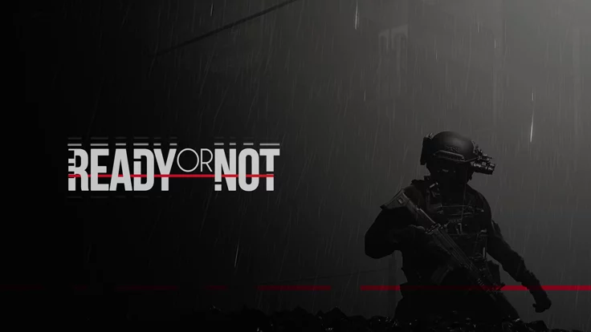

# Hi there!  👋 I'm SyntaxAdi

I design and build automation-driven software using Python — Telegram bot infrastructures, backend services, and AI-powered tools. My focus is creating practical systems that solve real problems without unnecessary complexity.

## About Me

I build automation systems and backend services using Python.  
My work focuses on Telegram bot infrastructure, API-driven services, and automation tools.  
Interested in building practical systems that solve real-world problems.

Technically, I work across:
- Python automation and bot frameworks (Telethon)
- Backend service development with FastAPI
- API integrations and workflow orchestration
- ML model deployment with Hugging Face and Gradio
- DevOps and Linux-based deployment environments 

## Technical Stack

## Featured Projects

### [Media-Downloader](https://github.com/SyntaxAdi/Media-Downloader)
*Async Telegram bot downloading media from 20+ platforms via modular per-site handlers*

**Stack:** Python, Telethon, asyncio, yt-dlp, gallery-dl, cloudscraper, pymongo, aiohttp, httpx, Pillow, BeautifulSoup4

- Modular async architecture with per-platform handlers for 20+ media sources including Instagram, TikTok, YouTube, Reddit, and Threads
- Media pipeline includes direct song downloads, Shazam-based music recognition, and CDN-side image compression for Telegram delivery limits
- Production bot controls include anti-spam protection, force-subscribe gating, and admin tools for remote update, restart, and log access

---

### [Udemy-Auto-Enroller](https://github.com/SyntaxAdi/Udemy-Auto-Enroller)
*Telegram bot that scrapes five course aggregators in parallel and auto-enrolls users in free Udemy courses*

**Stack:** Python, Telethon, asyncio, aiohttp, motor (async MongoDB), BeautifulSoup4, lxml, cloudscraper, python-dotenv

- Async parallel scraping across: Discudemy, Udemy Freebies, Real Discount, Tutorial Bar, Course Vania
- Course expiry validated before enrollment — filters dead deals before hitting the Udemy API
- Real-time enrollment progress updates sent in Telegram; per-user savings and stats tracking
- Daily rate limits, channel subscription gate, and admin usage reporting

---

### [ArthSaathi](https://github.com/SyntaxAdi/ArthSaathi)
*AI-powered personal finance web app for Indian youth — hackathon build, deployed on Vercel*

**Stack:** React 18, Vite 5, Tailwind CSS, Framer Motion, Supabase (PostgreSQL + Auth + RLS), Groq API (LLaMA 3.3 70B), React Router DOM v7

- Financial health score algorithm factoring savings rate, EMI ratio, and spending patterns
- LLM coach powered by LLaMA 3.3 70B via Groq; receives the user's full exported report as prompt context
- AI-suggested goals importable directly into the tracker with one click
- Full multilingual UI: English, Hindi, Tamil, Marathi — with per-user currency and number system settings

---

### [Word-Grid-Solver-Web](https://github.com/SyntaxAdi/Word-Grid-Solver-Web)
*Flask web app that solves word-search puzzles from uploaded images*

**Stack:** Python 3.9, Flask 3.0, Werkzeug, Requests, Vanilla JS/CSS, Docker (port 7860)

- Drag-and-drop image upload; grid extracted via remote Lambda-hosted OCR API (base64-encoded)
- 8-directional grid search (all 4 axes + diagonals) with jagged array handling
- Clue-based constraint solving — parses `A---- (5)` into start character + length pairs
- Dockerized deployment with a decoupled solver core that can also run as a standalone CLI tool

---

### [Kali-Portfolio](https://github.com/SyntaxAdi/Kali-Portfolio)
*Personal portfolio built as a Kali Linux desktop simulation*

**Stack:** React 19, Vite 7, Tailwind CSS, Framer Motion, shadcn/ui, Lucide React

- Desktop-style interface with a finite-state flow for boot, login, workspace, and shutdown transitions
- Window manager system handles app focus, stacking order, and multi-window interactions
- Visual polish includes boot logs, CRT effects, wallpaper cycling, and animated restart or shutdown sequences

---

### [Personal-Portfolio](https://github.com/SyntaxAdi/Personal-Portfolio)
*Minimal static portfolio — no framework, no build step*

**Stack:** HTML5, CSS3, Vanilla JS, Vercel

- Entire site self-contained in a single 43KB `index.html` with embedded CSS and JS
- Rotating anime/motivational quotes; `vercel.json` with SPA-style routing

## 📈 GitHub Stats

 

## Current Work

**LLM Applications**  
Experimenting with Gemini and Groq APIs to build AI-assisted tools and workflow automation.

**Telegram Bot Systems**  
Developing modular Telegram bot architectures using async Python frameworks and MTProto libraries.

**Automation Tools**  
Creating scripts and utilities that automate repetitive workflows and integrate multiple APIs.

**Backend Development**  
Building lightweight backend services with FastAPI and asynchronous Python.

**ML Experiments**  
Testing model hosting setups using Hugging Face, Gradio interfaces, and free GPU environments such as Colab.

## 🤝 Let's Connect! 
Open to collaborating on interesting technical projects, discussing engineering ideas, or exploring new opportunities.
- **💼 LinkedIn:** [aaditya-pawar2004](https://www.linkedin.com/in/aaditya-pawar2004)
- **📧 Email:** [aadityapawar00001@gmail.com](mailto:aadityapawar00001@gmail.com)
- **💬 Telegram:** [@ItzAditya_xD](https://t.me/ItzAditya_xD)
- **🌐 Portfolio:** [akenochan.my.id](https://akenochan.my.id)
